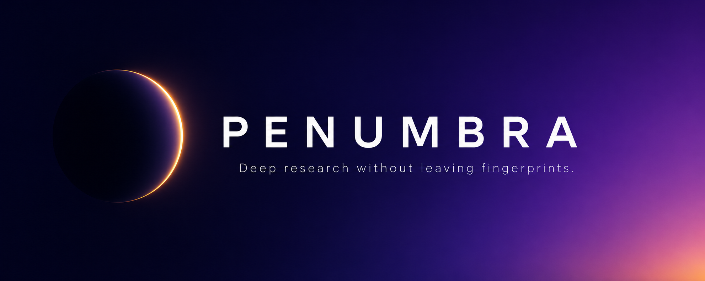

<p align="center">
  
</p>

<p align="center">
  <em>The first privacy-native research agent. Multi-step, multi-source, multi-LLM. Your queries never leave the shadow.</em>
</p>

<p align="center">
  <a href="https://github.com/Brankss/Penumbra/actions/workflows/test.yml"></a>
  <a href="https://opensource.org/licenses/MIT"></a>
  <a href="https://www.python.org/downloads/"></a>
  
</p>

<div align="center">

https://github.com/user-attachments/assets/7bb61b1a-21cf-4aa1-84f2-bd9c0512d7fd

<em>↑ Penumbra running a research query end-to-end on a local Ollama model, zero cloud calls.</em>

</div>

---

## Why Penumbra exists

`gpt-researcher` has 40k+ stars. It does deep multi-step research beautifully.
It also sends every one of your queries to OpenAI in cleartext, browses with a fingerprinted Chrome, and leaves a trail of your curiosity across every site it touches.

> *What you search reveals more about you than what you say.*

Penumbra fixes this. It's a **drop-in Python library** (and CLI, and MCP server) that does deep research the way gpt-researcher does — but with privacy as a first-class concern at every layer.

```python
from penumbra import Researcher

researcher = Researcher(privacy="high")
report = await researcher.run("Compare the latest open-source RAG frameworks in 2026")

print(report.markdown)
```

That's it. Behind the scenes:

- Every web request is routed through Tor with fresh circuits per source
- The browser is Playwright headless with randomized fingerprints (not Tor Browser bloat)
- Your query is PII-scrubbed before being sent to any LLM
- Sensitive subqueries can be auto-routed to a local model (Ollama) instead of the cloud
- Every source is verified across multiple search engines before being trusted
- The final report includes a citation graph you can audit

---

## What makes Penumbra different

The privacy-research space already has projects. None of them do what Penumbra does.

| Feature                          | Penumbra | gpt-researcher | Onion-Search-MCP | LLM-Tor | OnionClaw |
|----------------------------------|:--------:|:--------------:|:----------------:|:-------:|:---------:|
| Multi-step deep research          | ✅ | ✅ | ❌ | ❌ | ⚠️ |
| Native Tor routing                | ✅ | ❌ | ✅ | ✅ | ✅ |
| Drop-in Python library            | ✅ | ✅ | ❌ (MCP only) | ❌ | ❌ |
| Works without MCP                 | ✅ | ✅ | ❌ | ❌ | ❌ |
| Playwright headless (fast)        | ✅ | ✅ | ❌ (Tor Browser) | n/a | ❌ |
| PII scrubbing before LLM calls    | ✅ | ❌ | ❌ | ⚠️ | ❌ |
| Multi-LLM (cloud + local routing) | ✅ | ⚠️ | ❌ | ❌ | ❌ |
| Citation graph + verification     | ✅ | ⚠️ | ❌ | ❌ | ❌ |
| Per-source Tor circuit rotation   | ✅ | ❌ | ❌ | ⚠️ | ⚠️ |
| Fingerprint randomization         | ✅ | ❌ | partial | n/a | partial |
| Free-form privacy levels (0-3)    | ✅ | ❌ | ❌ | ❌ | ❌ |

Penumbra is not "gpt-researcher + Tor". It's a different architecture that **starts from threat model and works backwards** to the research workflow — not the other way around.

---

## 30-second quickstart

```bash
pip install penumbra-research[all]
playwright install chromium
```

If you want full Tor support (recommended), install Tor on your system:

```bash
# Windows (Chocolatey)
choco install tor

# macOS
brew install tor

# Debian/Ubuntu
sudo apt install tor
```

### Search backend

Penumbra runs search through the same headless Chromium it already uses for
fetching — DuckDuckGo first, Bing as fallback. **It works out of the box, with
no API keys.** Browser-based SERPs sidestep the rate-limiting and Cloudflare
challenges that destroy lightweight scrapers.

If you want a faster path (no browser overhead per query), opt in to a
dedicated search API by setting one of these env vars — Penumbra will detect
them automatically:

```bash
export BRAVE_API_KEY="..."     # optional, free 2000 queries/month
export TAVILY_API_KEY="..."    # optional, free $5 credit
```

You don't need either. They're a speed optimization, not a requirement.

Then:

```python
import asyncio
from penumbra import Researcher

async def main():
    async with Researcher(privacy="high") as r:
        report = await r.run("State of open-source LLM agents in 2026")
        print(report.markdown)
        report.save("output.md")

asyncio.run(main())
```

Or from the CLI:

```bash
penumbra "State of open-source LLM agents in 2026" --privacy high --output report.md
```

---

## Privacy levels

You don't always need maximum paranoia. Penumbra exposes a **0-3 privacy dial**:

| Level | Name      | Tor | Fingerprint | PII scrub | LLM routing            | Speed |
|-------|-----------|-----|-------------|-----------|------------------------|-------|
| 0     | `off`     | ❌  | ❌          | ❌        | Cloud only             | ⚡⚡⚡ |
| 1     | `low`     | ❌  | ✅          | ✅        | Cloud only             | ⚡⚡  |
| 2     | `medium`  | ✅  | ✅          | ✅        | Cloud (scrubbed)       | ⚡    |
| 3     | `high`    | ✅  | ✅          | ✅        | Local for sensitive    | 🐢   |

Picking the right level is a tradeoff. Penumbra lets you choose; most tools don't even offer the choice.

---

## Architecture

```
penumbra/
├── privacy/          → Tor controller, PII scrubber, fingerprint engine
├── llm/              → Provider-agnostic LLM abstraction (Anthropic, OpenAI, Ollama)
├── research/         → Planner, browser, content extractor, citation graph
├── output/           → Markdown / JSON / citation-graph rendering
└── core.py           → The Researcher class that ties it all together
```

The codebase is intentionally compact. The core is ~1500 lines of Python you can audit in an afternoon. No hidden dependencies, no telemetry, no phone-home.

---

## What Penumbra is NOT

- Not a dark-web crawler. It can route to `.onion` sites but that's not its purpose.
- Not a magic anonymity blanket. If you log into Google with your real account inside a Penumbra session, that's on you.
- Not a Tor Browser replacement. It's headless and meant for programmatic use.
- Not a proxy for chatting with LLMs anonymously — see [LLM-Tor](https://github.com/prince776/LLM-Tor) for that. Penumbra is about *research*.

---

## Use Penumbra inside any agent

Penumbra is a library. Plug it into anything:

```python
# Inside a LangGraph node
from penumbra import Researcher

async def research_node(state):
    async with Researcher(privacy="medium") as r:
        report = await r.run(state.question)
        return {"research": report.markdown}
```

```python
# As a tool exposed to any agent framework
from penumbra import Researcher

async def private_research(query: str) -> str:
    """Research a topic without leaving fingerprints."""
    async with Researcher(privacy="high") as r:
        report = await r.run(query)
        return report.markdown
```

---

## Roadmap

- [x] v0.1 — Core research engine, Tor routing, PII scrubbing, 3 LLM providers
- [ ] v0.2 — MCP server, citation-graph visualization, residential proxy support
- [ ] v0.3 — Browser session persistence with per-identity isolation
- [ ] v0.4 — Differential-privacy noise on aggregate queries
- [ ] v0.5 — Self-hosted search index (no DuckDuckGo dependency)

---

## Contributing

PRs welcome. The codebase is small enough that a weekend can land a meaningful feature.

Read [CONTRIBUTING.md](CONTRIBUTING.md) for the dev setup, test instructions, and PR checklist. The one rule: **every PR must justify itself against the threat model.** If a feature makes research better but privacy worse, it doesn't ship without a flag.

See [CHANGELOG.md](CHANGELOG.md) for the release history.

---

## License

MIT. Use it however you want. Just don't sell something Penumbra-powered without telling your users it's Penumbra-powered.

---

*The penumbra is the region of partial shadow. You're not invisible — that's impossible. You're not exposed — that's default. You choose the shade.*
